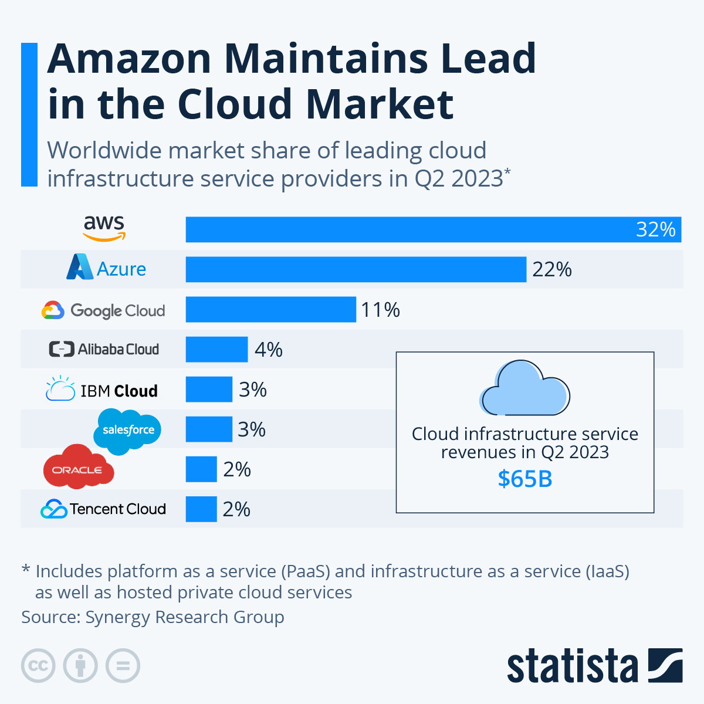

# Cloud Computing

## What is Cloud Computing?
Cloud computing refers to the delivery of computing services, including servers, storage, databases, networking, analytics, software, and intelligence, over the internet ("the cloud") to offer faster innovation, flexible resources, and economies of scale

## Quick History/Timeline of Cloud Computing
- **1960s:** The concept of cloud computing originated with the development of ARPANET, the precursor to the modern internet
- **1990s:** Telecommunications companies began offering virtual private network (VPN) services with comparable quality of service to their private systems
- **2006:** Amazon Web Services (AWS) introduced its Elastic Compute Cloud (EC2) as a commercial web service that allows small companies and individuals to rent computers on which to run their applications
- **2009:** Google and Microsoft entered the market with Google Cloud Platform and Microsoft Azure respectively
- **Present:** Cloud computing has become an integral part of the IT industry and is used by a wide range of organisations for various applications  
 

## What Can You Do with Cloud Computing?
- **Scalability:** Easily scale resources up or down based on demand
- **Data Storage:** Store and retrieve data from anywhere with an internet connection
- **Cost Efficiency:** Pay only for the resources you use
- **Collaboration:** Enable teams to work on projects in real-time from different locations
- **Development and Testing:** Provide developers with virtual environments for testing and development

## 4 Types of Cloud
1. **Public Cloud:** Services are provided over the internet and are available to anyone who wants to purchase them. (e.g., AWS, Azure, Google Cloud)
2. **Private Cloud:** Operated solely for a single organisation. It can be managed internally or by a third-party provider.
3. **Hybrid Cloud:** Combines elements of both public and private clouds, allowing data and applications to be shared between them.
4. **Multi-Cloud:** Utilises services from multiple public cloud providers.

### Examples
- Public Cloud: AWS, GCP, Azure
- Private Cloud: OpenStack, IBM Cloud Private
- Hybrid Cloud: Microsoft Azure
- Multi Cloud: Using Azure for integration and AWS for Serverless Computing

## Different Types of Cloud Service
1. **Infrastructure as a Service (IaaS):** Provides virtualised computing resources over the internet
2. **Platform as a Service (PaaS):** Offers a platform allowing developers to build, deploy, and manage applications
3. **Software as a Service (SaaS):** Delivers software applications over the internet on a subscription basis
4. **Function as a Service (FaaS):** Executes individual functions in response to events

## Advantages/Disadvantages for Business
### Advantages
- **Cost Efficiency:** Reduced hardware and maintenance costs
- **Scalability:** Easily adjust resources to accommodate growth
- **Flexibility and Mobility:** Access data and applications from anywhere
- **Disaster Recovery:** Improved data backup and recovery

### Disadvantages
- **Security Concerns:** Potential vulnerabilities in data protection
- **Dependence on Internet:** Reliance on a stable internet connection
- **Limited Customisation:** Less control over infrastructure configuration

## Opex vs Capex
- Capital expenditures or **Capex** are the companies major, long-term expenses while operating expenses or **Opex** are a company's day-to-day expenses

## Marketshare Breakdown

## 3 Largest Cloud Providers
1. **AWS:** Known for its extensive service offerings and established market presence
2. **Azure:** Strong integration with Microsoft products and services
3. **Google Cloud:** Emphasis on data analytics and machine learning capabilities

## 4 Pillars of DevOps
1. **Collaboration:** Encouraging cross-functional teams and effective communication
2. **Continuous Integration:** Integrating code changes into a shared repository frequently
3. **Continuous Delivery/Deployment:** Automating the process of delivering software to production
4. **Monitoring and Feedback:** Monitoring system performance and user feedback for improvements

### Linking DevOps and Cloud
Cloud computing provides the infrastructure and tools needed to implement DevOps practices effectively. It enables automated deployment, scalability, and collaboration across development and operations teams  

Resources:  
https://twitter.com/pioneersearch/status/1235552317895831553  
https://www.investopedia.com/  
https://www.statista.com/chart/18819/worldwide-market-share-of-leading-cloud-infrastructure-service-providers/  
https://learn.microsoft.com/en-us/training/modules/introduce-foundation-pillars-devops/2-discover-devops  
https://www.browserstack.com/guide/cloud-devops#:~:text=In%20cases%20like%20this%2C%20Cloud,tools%20to%20automate%20DevOps%20processes  

